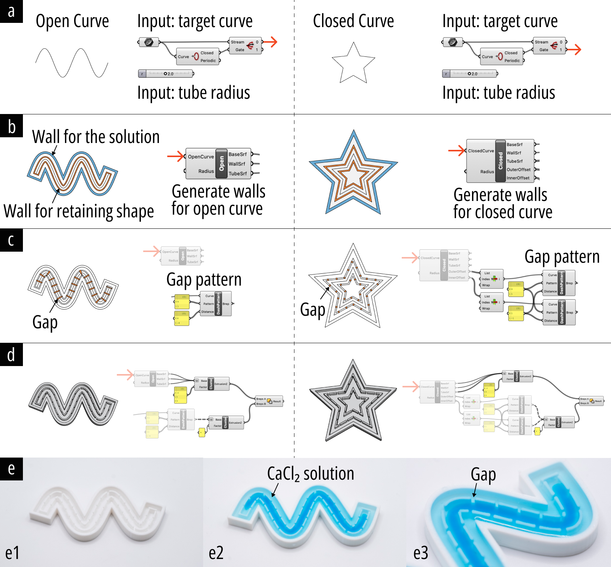

### Grasshopper Design Tool for Generating 3D Printed Reshape Mold for Alginate Fibers

Design tool for the mold to form alginate fibers into 2D geometries using the reshaping crosslinking process. (a) Users can input 2D curves and set the desired tubular alginate radius. (b) Walls are generated to retain the alginate shape and contain the $ \text{CaCl}_2 $ solution. (c) Gaps in the walls are created to allow the $ \text{CaCl}_2 $ solution to replenish calcium ions inside the inner walls, ensuring consistent crosslinking of the alginate fibers. (d) The final mold is generated and can be exported for 3D printing. (e) Printed mold and an example of usage.